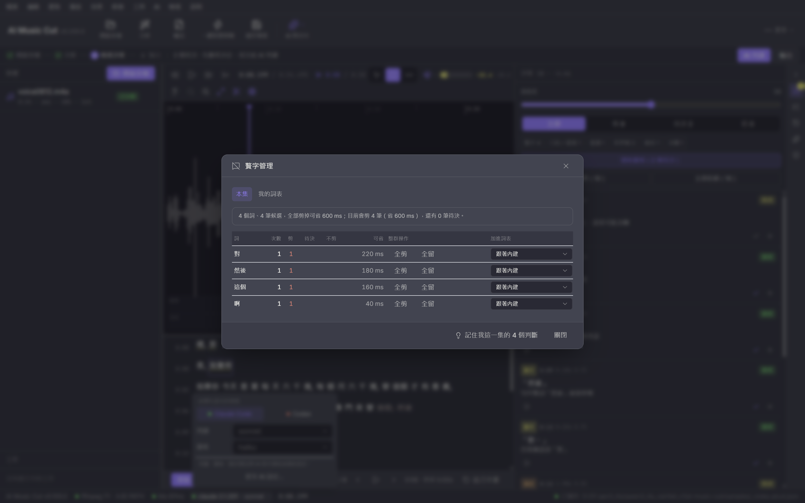
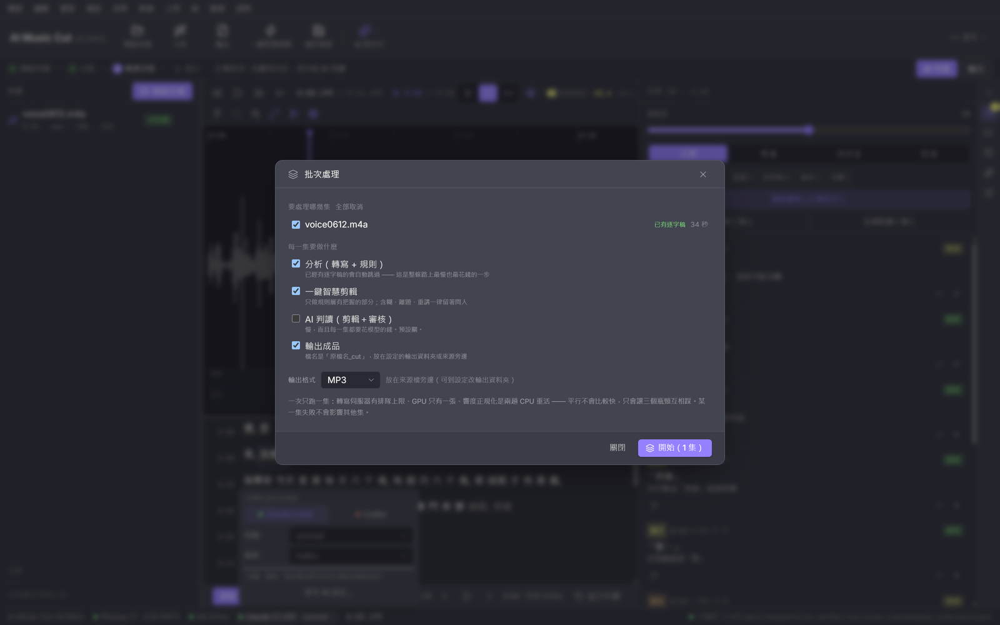
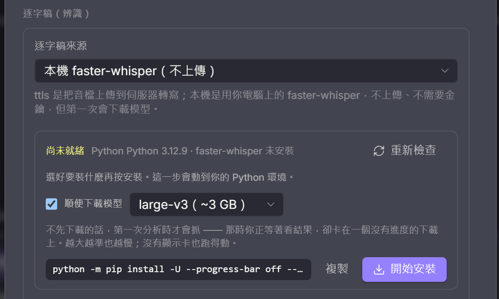
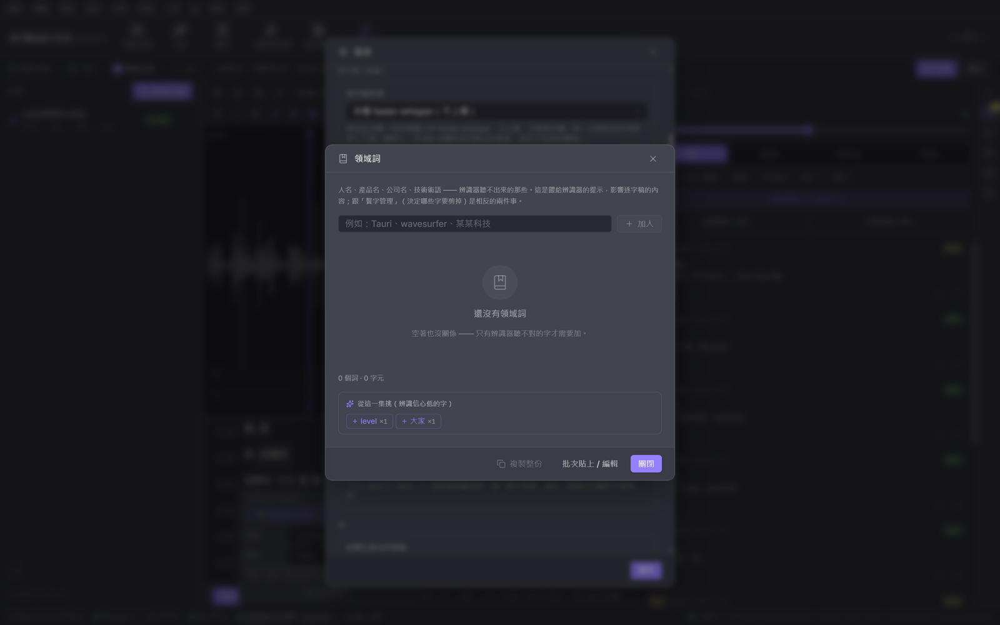
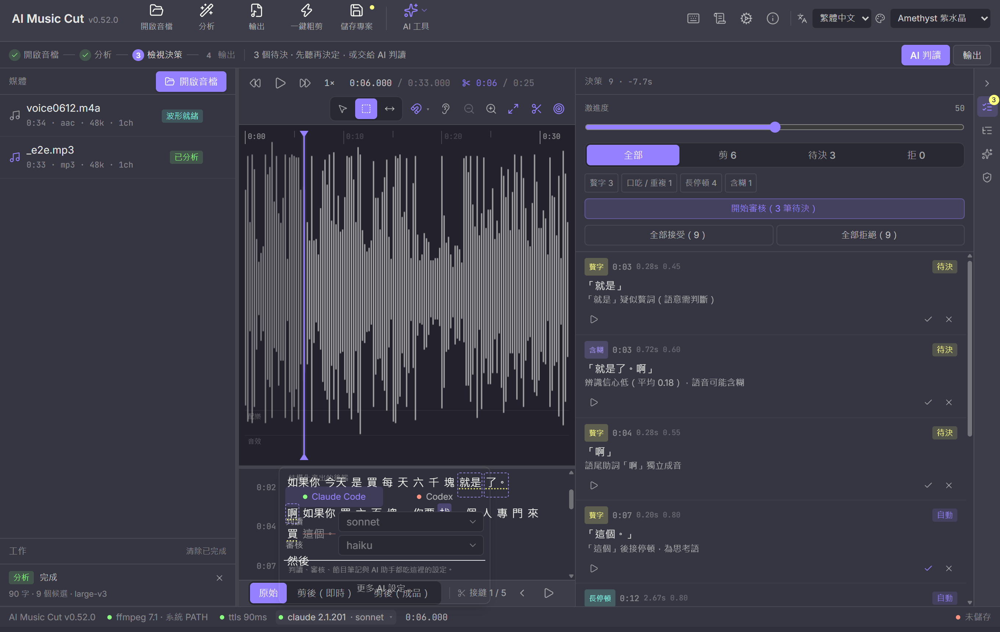

# AI Music Cut

[繁體中文](README.md) · **English**

> ☕ Free and open source. If it helps, [buy me a coffee](#support-open-source).

A desktop tool for smart editing of podcasts and audio (Tauri 2 + React 18), with a CLI. Drop in a recording and it will:

1. **Cut fillers and stutters**: um / uh / "you know" / "so, like" / re-starts mid-sentence — but **naturalness comes first**. A sentence-initial "then" or a filler that carries the rhythm is kept, not blanket-cut. The rule layer proposes candidates; Claude then reads each window and judges whether the cut still sounds natural.
2. **Loudness balance**: per-segment BS.1770 measurement → gain plan (±12 dB, peak guard, smoothing) → two-pass EBU R128 loudnorm, landing on your target (default −16 LUFS).
3. **Unclear / off-topic / "let me try that again" get suggested, not cut**: detected but never applied automatically — listed for you to accept or reject one by one.
4. **Humans can edit too, not just the AI**: the waveform is there the moment you open a file (no analysis needed). The Select tool drags out a range you can play (looped), cut, isolate, mute, fade or gain; candidate blocks can be dragged at the edges and double-clicked to toggle cut ↔ keep; in the transcript, Shift-click selects a range and double-clicking a word cuts it. Wave-editor-style right-click menu throughout.
5. **Editing toolset (Final Cut style)**: `B` blades at the playhead (a split changes no audio by itself — it just plants a handle you can grab; right-click it to **insert 200 / 500 / 1000 ms of silence** as a paragraph breath). `T` is the Trim tool: handles sprout on every seam — drag the **middle** to roll (both sides move together, total length unchanged), drag **either side** to ripple (everything after shifts). `N` toggles unified snapping (seams / sentence bounds / word bounds / beats, with tolerance that scales with zoom). `Shift+Delete` lifts — silence without closing the hole, for pulling a cough while keeping the rhythm.
   > A boundary you dragged by hand is **used as-is**: no ±30 ms lowest-energy search, no breath backfill (those two exist to land *AI-proposed* cuts in quiet spots). Only a ±3 ms zero-crossing nudge stays, to stop clicks. That is why a roll trim really does leave the output length untouched.
6. **Shuttle and precision trimming**: `J` / `K` / `L` is a real shuttle — repeated presses accelerate 1x → 2x → 4x, and **J and L cancel each other** (overshoot, tap the other way, and you slow down rather than slamming into reverse); hold `K` and tap for 0.5x. Reverse only moves the playhead (`<audio>` cannot play backwards, so the UI labels it "muted"). `I` / `O` set in/out points, `Alt+←/→` nudges ±10 ms (`Shift` for ±1 ms). Right-click a seam → "Precision trim here" opens the **precision editor**: the top lane is the source (cut material struck through), the bottom lane is what you will actually hear, drawn at the same ms/px scale, with transcript words laid over the waveform near the seam — so "this cut eats half a word" is something you can *see*. Play just the left tail or just the right head, trim 1 ms at a time, and `[` `]` jump between seams.
7. **Markers, timeline index, chapter export**: `M` drops a marker, `Shift+M` a chapter, `Alt+M` a to-do, `Alt+[` `Alt+]` jump between them (the waveform right-click menu and the Index tab's "add at playhead" do the same thing — no shortcut memorising required). Pins are drawn on the time ruler, draggable, right-clickable to change type. The **Index** tab on the right is Final Cut's Timeline Index — the whole timeline flattened into one searchable, filterable list (chapters / markers / to-dos / seams / effects); click to jump, edit chapter titles inline. **Chapters are written into the output file**: ID3 CHAP for mp3, QuickTime chapters for m4a (Apple Podcasts and Spotify read them), with times converted automatically from *source* to *after the cut*. To-dos can be ticked off; the open count shows on the tab.
8. **Music / SFX lanes with automatic ducking**: two lanes sit under the waveform. Right-click the waveform to drop a file from the media list in as **music** (−18 dB, two-second fades by default) or an **SFX**; drag to move, drag the edges to trim. Right-click music → "duck under the voice" computes **visible, draggable volume control points** from the speech regions (down before the speaker opens their mouth, back up after) rather than handing it to a compressor to guess — the curve is drawn on the music bar and **every point can be dragged**: up/down for volume, left/right for time, `Alt`+click to add, right-click to remove. Positions are pinned to **output time**: cut a few more fillers later and the music does not slide forward. With a range selected, the share button on the action bar can **export just that range** (for social clips): edits, music and ducking all apply, only the head and tail are clamped, and the project itself is untouched. On export you can tick "also export stems": voice in one file, music + SFX in another (all three share one loudness measurement, so the relative levels between stems match the full mix). An outro can extend **past the last spoken word** and the output grows with it (no hard cut the instant the talking stops). **Press play and you hear it right away** (music follows the playhead through seeks and shuttle speeds); the sample-accurate mix happens in the export pass, inserted before loudnorm, so the target loudness is measured on what you actually hear.
9. **Multi-microphone sync (Final Cut's Synchronize Clips)**: one track per person recorded remotely, each hitting record seconds apart. Toolbar → "Sync mics" → tick the tracks (the first is the reference) → they are aligned on the **speech rhythm both tracks can hear** (energy envelope, not the waveform), with each track's offset and confidence listed. Confirm and they merge into one `_synced.wav` to keep editing. Originals are never touched; when confidence is low it says "these probably did not line up" instead of merging anyway.
   The merge can also **reduce bleed** (someone else's voice leaking into this mic — merged, you hear the same sentence twice: once clear, once smeared). The threshold is measured **from each track's own energy distribution**, not hard-coded: every mic has a different gain, distance and room, so any fixed number clips someone's breath and does nothing for someone else. Tracks with no quiet passages at all are skipped.
10. **Cutting music: beat grid and snapping**: BPM is detected from waveform energy (autocorrelation) the moment you open a file; beat and bar lines are drawn on the timeline and selections snap to beats — cut on the beat and the join does not break. **You can fix a wrong guess in one click**: ÷2 / ×2 for half/double time, set the playhead as the downbeat, or tap tempo three times.
11. **Automatic highlight**: toolbar → "Highlight" → pick 15 / 30 / 60 / 90 s and the most chorus-like passage is chosen by energy and groove (snapped to bars when a beat grid exists). Audition it, then "select only" to fine-tune yourself or "keep only this" (fades added automatically).
12. **AI music (ACE-Step)**: describe a style and get instrumental BGM; the length is filled in from the current selection and the BPM from the detected tempo. The result lands in the media list ready to cut, snap to beats and export.
13. **Style transfer**: select a range → right-click "Change to another style…" or the palette button on the action bar → describe the target (lo-fi, acoustic guitar, cinematic, 8-bit…). The selected range is the reference for audio2audio; a closeness slider decides between "keep the original melody" and "run free".
14. **Vocal removal / stem separation**: split vocals from the instrumental (or into 4 stems) in one click — the instrumental stem *is* the karaoke version, and you can keep editing it.
15. **Transcript search and bulk removal (Descript-style text editing)**: `Ctrl+F` searches the transcript — matching ignores punctuation and whitespace, so a doubled "so, so" is found even with the comma in between, and matches can span sentences. Hits are highlighted, `Enter` steps through them, and "Cut all (N)" handles every instance in the episode at once — **one undo restores them all**. The search bar also lists the verbal tics that actually occur in *this* episode (chips like `uh ×23`; click to fill it in) — the rule layer knows acoustics plus a word list, and it cannot know *your* particular tic.
   > Cutting "that one sentence" was always possible from the transcript (Shift-click a range → Delete). What this solves is the **repetition** case: cutting 23 "uh"s one at a time is the most tedious thing in the whole tool.

15b. **Filler management (handle a whole word at once)**: a 57-minute episode produces well over a thousand filler candidates, and there is no reviewing those one at a time — but they are really only twenty or thirty *words*: "then" four hundred times, "so" two hundred, "right" a hundred. Toolbar → "Filler words" lays them out **as one row per word** (count / cut / pending / kept / how much time it would save) with "cut all" and "keep all" on each row.
   The other tab is a **personal word list that carries across episodes**: every host has different tics, the built-in list is the generic one, and yours stacks on top of it (always cut / depends on context / never cut). **Only the words you touched are stored** — store them all and, when the built-in list improves later, you would be frozen on the old version without ever noticing. Whisper splits a phrase like "you know what I mean" into several tokens, so custom multi-word entries are matched by concatenating tokens (a gap over 200 ms means it is not the same phrase).
   > Changing the list does not retroactively change candidates that were already computed (those come from analysis time), so there is an explicit "Apply to this episode (re-run rules)" button, flagged as soon as you edit the list. That is not something a user should have to guess at.

15c. **Domain words (so the recogniser hears them right)**: names, products, companies, technical terms — the ones ASR mishears. Settings → Transcript → Domain words → "Manage": chip-style add/remove, bulk paste, dedupe (case-insensitive but keeping your spelling), character count and a soft-limit warning.
   What makes it actually useful is **suggestions drawn from this episode's low-confidence words**: nobody can recall from memory which words to add, but seeing "‘Tauri’ came out three different ways, confidence 0.2" tells you immediately. Fillers are excluded from the suggestions — "you know" scoring low means it was mumbled, not that the recogniser does not know it, and adding it would only make the recogniser strain to hear a word you are about to cut.
   > **Domain words and filler management are opposites**: domain words act *before* recognition (hear these right), the filler list acts *after* it (cut these out).

16. **Skimming**: turn it on with `Shift+S` and moving the mouse over the waveform plays the audio under the cursor (Final Cut's audio skimming). Far faster than dragging the playhead to find "where was that line". Off by default — audio that plays because the mouse passed over something needs consent. It gets out of the way during playback so two sounds never stack.

17. **Highlight reel (stitching scattered good bits into a trailer)**: what you post after finishing an episode is usually not a contiguous 60 seconds but three to five lines scattered across it. Select a range → the star on the action bar adds it to "Highlights" → the toolbar's "Highlight reel" list lets you audition, name and remove each one → export in one click. Segments are crossfaded 120 ms (they are unrelated in the original recording; butt-joining them is jarring), overlapping segments are merged (otherwise you hear the same sentence twice), and the head and tail fade automatically (a trailer always starts and ends mid-sentence, and without a fade that is a hard cut into the middle of a word). You can pick a **music bed** for the whole reel (−22 dB, fades at both ends). The project is untouched; reels do not write chapters.

18. **Cleanup (rumble / noise / de-esser)**: toolbar → "Cleanup". **De-rumble** is an 80 Hz high-pass — desk bumps, air conditioning and footsteps all live below it and the lowest vocal fundamental is around 85 Hz, so it costs essentially nothing and the suggested setting is always on. **Noise reduction** first measures how loud this recording is *when nobody is talking* and then decides how much to remove; below a −58 dBFS noise floor it is not recommended (more reduction only eats the tails of words), capped at 18 dB (too much produces watery artefacts in quiet passages). **De-essing is off by default** — waveform analysis only has the energy envelope, no spectrum, so there is no measurement that could justify "this mic is sibilant"; you A/B it yourself first. The whole dialog is built around A/B: the same passage, same position, rendered both ways, switch back and forth.
   > Cleanup is applied **before loudness normalisation, on both the measurement and the encode pass**. loudnorm runs `linear=true`, and the numbers from pass 1 directly determine the gain in pass 2; cleaning only on the encode pass would measure unclean loudness and apply it to a cleaned signal, leaving the output quiet. Measured on a 12-second clip: noise floor −23.7 → −78.3 dB, RMS moved 0.25 dB.

19. **Show notes**: hit "Show notes" in the toolbar when you are done and the local `claude` reads the episode and writes a summary, chapters, quotable lines and keywords. Copy the Markdown or save a `.md` for your blog or RSS; chapters can be turned into markers in one click (and therefore end up in the output file). Generated notes are stored in the project, so closing and reopening does not re-run them (regenerating means claude reads the whole episode again).
   > **Timestamps are output time, not transcript time.** The transcript lives on the source timeline with a whole EDL in between — after cutting 20 fillers, the line at source 12:30 is at 12:11 in the output, and the error grows the more you cut and grows *silently*. So the material fed to claude is converted first, and the timestamps that come back are validated against the episode length again (anything unparseable, past the end, or not increasing is dropped — better one chapter short than a listener tapping a chapter and landing in silence). Cut sentences are never fed in at all.

20. **Export verification (the last human-in-the-loop gate)**: **audio comparison** (fully local) cross-correlates the normalised envelope of each output segment against the source and catches wrong segments or drifted positions; when the output has music mixed in it automatically switches to **position-only comparison** (extra music makes the envelopes different by construction, and forcing a waveform-similarity check would raise false alarms on a perfectly good output). With a transcript, **ASR word comparison** is added on top (the output is re-transcribed, flagging dropped words, things that should have been cut, and suspicious seams), and every finding has "listen" and "go fix it".
21. **AI assistant (Claude Code style tool loop)**: the local `claude` CLI drives editing decisions through the app's built-in MCP server — "cut every 'so' after the 10-minute mark, but keep the sentence-initial ones". 37 tools cover decisions, seams and trimming (`list_seams` / `blade_at` / `trim_seam` / `insert_pause` / `set_selection` / `lift_selection` / `add_effect`), the transcript (`find_text` / `cut_text`), markers and chapters, music and ducking, mic sync, cleanup (`get_cleanup` / `set_cleanup`), highlights (`list_highlights` / `add_highlight`) and show notes (`write_show_notes` / `get_show_notes`) — so it also handles "blade at 12:30 and push the seam 200 ms left" or "check whether the noise floor needs work, and cut the verbal tics while you are at it".
22. **Batch (several episodes in one go)**: a weekly show often has several episodes in flight (a re-record, last week's unfinished one, a session recorded in parts). Toolbar → "Batch": tick the episodes and the steps (analyse → smart edit → AI judging → export), and when it finishes you get a per-episode report of how much was saved, where the output went, and which step was skipped.
   **One episode at a time**: the transcription server has a queue cap, there is one GPU, and loudness normalisation is two CPU-heavy passes — running in parallel would not be faster, just three bottlenecks fighting each other. Episodes that already have a transcript skip analysis (the slowest and most expensive step in the chain); AI judging is off by default (slow, and it costs model tokens per episode). **A failure on one episode does not affect the others** — the error stays on that row. The thing you fear most in a batch is it dying on episode 4 and taking the first three with it.

Speech recognition, source separation and music generation are served by self-hosted [ttls](https://ttls.markkulab.net/) (Seal-TTS REST; `/v1/transcribe` = faster-whisper large-v3 word timestamps, `/v1/separate` = demucs htdemucs, `/v1/music` = ACE-Step).

37. **Finding things: command palette, right-click submenus, and no silent greying-out**: once there are this many features, the usual problem is not "how" but "where". `Ctrl+K` searches everything (translated names, the Chinese originals, English keywords and shortcuts all match); select a range on the waveform and right-click, and the "Effects ▸ / Repair ▸" submenus list what can be done to that range; the toolbar keeps five primary actions (open / analyze / export / one-click smart edit / save) and everything else lives under "AI & delivery ▾" and "More ▾".
   **Disabled features say why**: the toolbar tooltip, the context menu and the palette's right-hand column all show the same reason ("select a range on the waveform first", "analyze first"), and clicking anyway toasts that sentence instead of doing nothing.
   > Underneath is one command table (`src/commands/`): a feature is declared once and the shortcut list, toolbar, context menu and palette are all generated from it. Before, it was 22 booleans, 41 props and a hand-copied shortcut table — nobody noticed it was missing Alt+X and Shift+I/O. Also fixed along the way: under a Chinese IME, `Shift+S` (skimming) could never fire.


*Above: after analysis — media list on the left, waveform in the middle (purple blocks are candidates, the transcript sits below with cut words struck through), decision panel on the right listing each candidate with its reason and type, and the status bar showing live ffmpeg / ttls / claude state plus the current model.*

| Filler management | Batch |
| --- | --- |
| [](docs/screenshot-fillers.png) | [](docs/screenshot-batch.png) |
| The whole episode's fillers laid out per word — cut all or keep all in one click; the other tab is a personal word list that carries across episodes. | Tick the episodes and steps, one episode at a time, with a per-episode report of what was saved and where it went. |

| Local ASR install | Domain words |
| --- | --- |
| [](docs/screenshot-localasr.png) | [](docs/screenshot-hotwords.png) |
| Choose the package and model, then press install; you see the exact command first, and the output streams line by line. | Chip-style add/remove and bulk paste; suggestions come from the words this episode's recogniser was least sure about (fillers excluded). |

## Support open source

This tool is free and open source. If it saved you time, buy me a coffee so the updates keep coming.

[](https://www.paypal.com/ncp/payment/8B7GRXA6UJH36)
[](https://www.paypal.com/ncp/payment/8LBTFUBBF2CHS)
[](https://www.paypal.com/ncp/payment/A653DD46GEU4W)
[](https://www.paypal.com/ncp/payment/Y5WPSXVGH3YS4)

For any other amount, use [PayPal.Me](https://paypal.me/226network).

## AI backend

**Structured output** (AI judging, review, show notes) can use **Claude Code** or **Codex**.
Codex goes through `codex exec --output-schema`; its model is set in Codex's own `$CODEX_HOME/config.toml`.
If it is not installed: `npm i -g @openai/codex`, then `codex login`.

**Click `claude 2.1.201 · sonnet` in the status bar** to switch backend and model (judging and review each have their own).
The model is something you may want to change before every judging run — the hard episode gets one opus pass, the rest get swept with haiku — and burying it on the second page of a settings dialog means three clicks every time. With Codex selected the model dropdowns are not greyed out but replaced with a sentence explaining why (Codex reads its model from its own config.toml, which this app cannot write to): greying something out without explaining it just reads as broken.



> **The AI assistant (tool loop) always uses claude** and ignores this setting.
> The assistant drives editing decisions through the app's built-in MCP server, and for Codex to
> reach that server you would have to edit your own `config.toml` — that is your environment's
> configuration, and the app cannot write it. The settings screen says so, so nobody switches over
> expecting everything to keep working.

## Prompts

The system prompts for all four roles (editor / reviewer / show notes / assistant) can be edited inside the app (toolbar → "Prompts").
These strings *are* the AI's behaviour — how strict the judging is, what stance the reviewer takes, the tone of the show notes — and hard-coding them means "to tune this, edit the source and recompile", when prompts are exactly the thing you need to iterate on.

Each one states **who uses it** and **what breaks if you get it wrong**; edited ones are badged, and can be reset or exported as JSON to share.
**Only the ones you changed are stored**: store them all and, when the defaults improve later, your settings file freezes you on the old version without ever telling you.

> Output language does not belong in the prompt — it is appended at runtime from the episode / UI language.

## Languages

The interface ships in **Traditional Chinese / Simplified Chinese / Japanese / English** (switch in the top right).

Translation keys are the Traditional Chinese source strings, with identity fallback — so a language missing a few entries does not break, those entries just show Chinese. `npm run check` runs `scripts/check-i18n.mjs` to block strings that will appear on screen but never made it into a catalogue.

> The audit has to scan two shapes: `t("literal")`, and `t(table[k])` where the string lives in a label table **in another file** (shortcut help, candidate kinds, theme names, undo labels…). Scanning only the first misses the second wholesale, and the symptom is switching to Japanese and finding a screen full of Chinese while the audit reports zero gaps. That actually happened.

**What language the AI writes in is a separate question**: show notes and chapters follow **the episode** (the language ASR detected) because they are for the listeners; judging rationales and assistant replies follow the interface, because they are for the person editing. You can change it in the show-notes window.

## Requirements

- Windows 10/11 (macOS / Linux can be built from source, see `.github/workflows/release.yml`)
- **ffmpeg**: bundled with the Windows installer (LGPL build, see [THIRD-PARTY-NOTICES.txt](THIRD-PARTY-NOTICES.txt)) — it works out of the box.
  - Yours wins: resolution order is "custom path in settings → system PATH → bundled → common install locations", and the status bar shows which one is in use.
  - macOS / Linux do not bundle it yet; install [ffmpeg 7+](https://ffmpeg.org/) (the deb / rpm packages declare the dependency).
  - Building from source, the bundled copy comes from `node scripts/fetch-ffmpeg.mjs` (URL and sha256 pinned in `scripts/ffmpeg-manifest.json`); skipping it still works for development, it just falls back to PATH.
- A ttls API key (Settings → Server; **stored only in the OS keychain, never in any file**) — without a key you can still see the waveform, edit by hand and export
- **Local recognition is the default** (Settings → transcript source): the same large-v3 runs on your own machine, nothing uploaded, no key needed.
  The app detects whether Python and the package are ready, and if not you **pick a model and press one button** (package and model fetched together, output streamed line by line).
  You see the exact command before pressing it — this step modifies your Python environment.
  The output format matches ttls exactly, so the rule layer receives identical signals (word timestamps, no_speech, avg_logprob, compression_ratio).
- Optional: a logged-in [Claude Code](https://claude.com/claude-code) CLI (for AI judging / the assistant; default model sonnet, changeable in settings or from the status bar)

## Usage

The workflow strip at the top tells you where you are and what to press next: **① Open audio → ② Analyse → ③ Review decisions → ④ Export**.

1. Open a file (or drag it into the window) → the whole waveform and time ruler appear within seconds; playable and zoomable immediately (Ctrl+wheel / `Ctrl+=` `-` `0`).
2. **Edit by hand** (any time): press `S` for the Select tool, drag a range on the waveform → the action bar or right-click menu: play (Space, loopable), cut (Delete), isolate, mute, fade in / out, gain, zoom to selection (Z). `V` returns to the Position tool.
3. **Analyse**: transcode, upload to ttls for transcription, and let the rule layer propose candidates (fillers / stutters / long pauses / unclear / noise). Without a key it takes you straight to the settings field rather than uploading for nothing.
4. Work the decision panel: green tick accepts, cross rejects; the aggressiveness slider recomputes live; `[` `]` move between entries, `A` / `R` decide, `P` previews; drag the edges of a block on the waveform to adjust the range, double-click to toggle.
5. **AI judging**: Claude reviews candidates window by window (apply / suggest / drop) and adds unclear / off-topic suggestions.
6. **AI assistant**: drive it in plain language (every tool call is shown).
6b. **Transcript search**: `Ctrl+F` → `Enter` to step through → "Cut all (N)" to handle an episode's worth of one tic at once (one undo restores everything).
6c. **Cleanup**: toolbar → "Cleanup" → look at the measured noise floor → take the suggestion or set your own → A/B the same passage clean and raw → apply.
7. **Export**: pick format / target loudness / whether to balance per segment → mp3 / m4a / wav. Effects (mute / fades / gain) and cleanup are applied too.
7b. **ASR verification**: after exporting, hit "Verify with ASR" (or step ④ in the workflow strip); the output is re-transcribed and compared word by word, and the report lists dropped words / things that should have been cut / suspicious seams, each with "listen" and "go fix it".
8. **Vocal removal**: toolbar → "Remove vocals" → 2 or 4 stems → each is written next to the source and added to the media list.

Projects are saved as `*.aicut.json` (transcript, candidates, decisions, effects, AI judging cache). Reopening the same audio reuses the cache instead of re-running ASR. `F1` shows the full shortcut list.

> With a Chinese IME active, letter shortcuts are swallowed by the IME — switch to alphanumeric mode. Every action also has a button and a right-click entry.

## CLI

```bash
npm run cli:build                                   # bundle to dist-cli/aicut.mjs (single file, Node 20+)
node dist-cli/aicut.mjs transcribe ep12.m4a         # transcript (--json out.json keeps the raw JSON)
node dist-cli/aicut.mjs analyze ep12.m4a --judge --project ep12.aicut.json   # rules + AI judging, saved as a project for the app
node dist-cli/aicut.mjs cut ep12.m4a --judge -o ep12_cut.mp3               # all the way to an output file
node dist-cli/aicut.mjs cut --project ep12.aicut.json                      # reuse decisions / manual edits / effects saved by the app
node dist-cli/aicut.mjs separate song.mp3 --format wav                     # vocal removal: song_vocals.wav / song_accompaniment.wav
node dist-cli/aicut.mjs beats song.mp3                                     # BPM / beats (--bars lists bar lines)
node dist-cli/aicut.mjs music "lofi hip hop, warm" --duration 30 --bpm 90  # AI music (ACE-Step, --quality fast|fine|max)
node dist-cli/aicut.mjs style song.mp3 "acoustic guitar" --from 30 --to 60   # style transfer (--strength 0–1)
node dist-cli/aicut.mjs verify ep12.m4a ep12_cut.mp3                       # ASR verification (dropped words / missed cuts → exit code 2, CI-friendly)
```

Key: `--key`, the `AICUT_TTLS_API_KEY` environment variable, or `.env.local` in the project root; it is never printed and never written to any output.

**How the CLI differs from the app** (`cut --project` warns about each one rather than quietly doing less): the CLI's cutter is ffmpeg `atrim` + `concat`, so it only does global loudnorm (no per-segment balancing), **does not mix in music / SFX**, and **does not write chapters**. When a project contains those things the CLI says out loud what it skipped; use the app's export for a complete master. Splits, manual edits, effects and decisions are carried over exactly.

## Development

```bash
npm install --legacy-peer-deps
npm run tauri dev        # frontend on 1420 + Rust; the first Rust build takes 5–10 minutes
npm run check            # tsc + eslint + vitest + i18n audit + secret scan
cd src-tauri && cargo test --no-default-features
```

Dev conveniences: copy `.env.example` to `.env.local` (gitignored) and fill in `AICUT_TTLS_API_KEY`; it is only consulted in debug builds when the keychain is empty. Smoke-test hooks: `AICUT_DEV_OPEN=<audio> AICUT_DEV_ANALYZE=1 AICUT_DEV_RENDER=1 npm run tauri dev`.

## Architecture

See [docs/architecture.md](docs/architecture.md). The shell, UI primitives, theming and Claude CLI bridge are ported from [db-kit](https://github.com/markku636/db-kit).

## Licence

MIT
