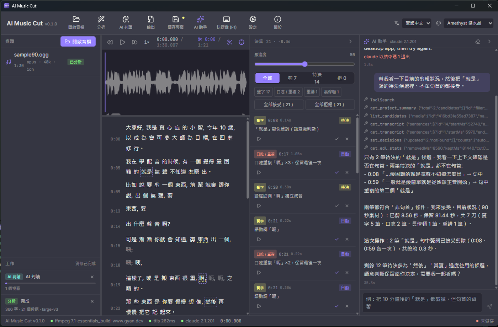

# AI Music Cut

AI Podcast / 音訊粗剪桌面工具（Tauri 2 + React 18），也有 CLI。丟進一段錄音，它會：

1. **剪贅字與口吃**：嗯／呃／那個／就是／我我我……以及講到一半重講的片段，但**以自然順暢為最高原則**——句首的「然後」、有節奏感的語助詞會保留，不是全剪。規則層先提候選，Claude 再逐段判讀自然度。
2. **音量平衡**：逐段 BS.1770 量測 → 增益規劃（±12 dB、峰值守門、平滑）→ EBU R128 loudnorm 兩趟，成品落在目標響度（預設 −16 LUFS）。
3. **含糊 / 離題 / 「再來一次」段落給建議**：偵測到但不自動剪，列成建議讓你逐一接受或拒絕。
4. **人也能剪，不只 AI**：開檔就有波形（不必先分析），「選取」工具拖一段就能播放（可循環）、剪掉、只保留、靜音、淡入淡出、增益；候選色塊可拉邊界、雙擊剪 ↔ 不剪；逐字稿 Shift+點選範圍、雙擊字直接剪。Wave Editor 式右鍵選單。
5. **剪輯工具組（Final Cut 式）**：`B` 刀片在播放線切一刀（切點本身不動聲音，只是立一個抓得住的把手，右鍵可以在這裡**插入 200 / 500 / 1000 ms 留白**當段落呼吸）；`T` 修剪工具在每個接縫長出把手 —— 拖**中間**是捲動（roll，接縫左右一起動，成品總長不變），拖**兩側**是漣漪（ripple，後面整串跟著位移）；`N` 統一吸附（接縫 / 句界 / 字界 / 拍點，容差跟著縮放走）；`Shift+Delete` 提起（lift）＝留白靜音不關洞，拿掉咳嗽但保留節奏。
   > 人親手拖出來的邊界會**照著用**：不再做 ±30 ms 的能量最低點搜尋、也不回填呼吸（那兩段是為了讓 AI 提的候選落在安靜處）。只保留 ±3 ms 的零交越微調擋 click。所以捲動修剪真的不會改變成品長度。
6. **轉盤與精準修剪**：`J` / `K` / `L` 是真的轉盤 —— 連按加速 1x → 2x → 4x，**J 與 L 互相抵銷**（衝過頭反手點一下是降速，不是立刻倒帶），按住 `K` 再點是 0.5x 慢速；倒退只移動播放線（`<audio>` 放不出反向音訊，UI 會標「靜音」）。`I` / `O` 標入出點，`Alt+←/→` 微調 ±10 ms（加 `Shift` 是 ±1 ms）。右鍵接縫 →「在這裡精準修剪」打開**精準修剪器**：上排是來源（被剪掉的打斜線）、下排是剪完真正會聽到的接法，同一個 ms/px 比例並排，接縫附近的字疊在波形上，所以「吃掉半個字」用看的就看得出來；可以只聽左尾 / 只聽右頭、逐 1 ms 修，`[` `]` 在接縫之間跳。
7. **標記、時間軸索引、章節匯出**：`M` 下標記、`Shift+M` 下章節、`Alt+M` 下待辦、`Alt+[` `Alt+]` 在標記之間跳（波形右鍵與索引分頁的「在播放線新增」也都做得到，不用記快捷鍵）；圖釘畫在時間尺上可以拖、可以右鍵改類型。右側「索引」分頁是 Final Cut 的 Timeline Index —— 把整條時間軸攤成一份可搜尋、可篩選的清單（章節 / 標記 / 待辦 / 接縫 / 效果），點一下就跳過去，章節標題直接在這裡改。**章節會寫進成品檔案**：mp3 得到 ID3 CHAP、m4a 得到 QuickTime 章節（Apple Podcasts / Spotify 讀得到），時間會自動從「來源」換算成「剪完之後」的位置。待辦可以打勾，未完成的數量顯示在分頁上。
8. **配樂 / 音效軌與自動閃避**：波形下緣多了兩條 lane。在波形上右鍵就能把媒體清單裡的檔案放成**配樂**（預設 −18 dB、兩秒進出）或**音效**，拖曳移動、拖邊界修剪。右鍵配樂 →「讓配樂在人聲下自動閃避」會依人聲區間算出**看得見也拖得動的音量控制點**（人聲開口前先壓下去、講完再回來），而不是丟給壓縮器猜——曲線就畫在音樂條上，**每個控制點都能拖**：上下改音量、左右改時間、`Alt`+點加一個、右鍵移除。位置釘在**成品時間**：之後再多剪掉幾個贅字，音樂不會跟著往前跑。選好一段之後，選取列的分享鈕可以**只輸出這一段**（社群短片用）：剪輯、配樂與閃避全部照舊，只是頭尾被夾掉，專案本身完全不動。輸出時可以勾「同時輸出分軌」，人聲一個檔、配樂與音效一個檔（三個檔共用同一組響度量測，所以各軌之間的相對音量跟完整混音一致）。片尾曲可以拖到**最後一句話之後**，成品會跟著變長（不會在講完的那一刻被硬切）。**放完直接按播放就聽得到**（配樂跟著播放線走，跳播、轉盤變速都跟得上）；成品的精準混音在輸出那一趟做，插在 loudnorm 之前，所以目標響度算的是你實際聽到的那一份。
9. **多麥克風同步（Final Cut 的 Synchronize Clips）**：一人一軌的遠端錄音，各自按下錄音會差好幾秒。工具列「同步麥克風」→ 勾選各軌（第一個是基準）→ 自動用**兩軌都聽得到的講話節奏**（能量包絡，不是波形）對齊，列出各軌位移與信心，確認後併成一個 `_synced.wav` 繼續剪。原始檔案不會被動到；信心偏低時會明講「可能沒對上」而不是硬合併。
   合併時可以順便**降低串音**（別人講話漏進這支麥的聲音，合起來會讓同一句聽到兩次：一次清楚、一次糊的）。門檻是從**每一軌自己的能量分布量出來**的，不是寫死的數字 —— 每支麥的增益、距離、房間都不一樣，寫死一定有人被切掉氣音、有人完全沒作用。本來就沒有安靜段的軌會自動跳過。
10. **剪音樂：節拍格線與貼齊**：開檔就從波形能量自動抓 BPM（自相關），時間軸畫出拍線與小節線，選取自動吸附到拍點——剪在拍子上，接起來才不會破。**AI 抓錯也能一鍵修**：÷2 / ×2 換半拍倍拍、把播放位置設成小節首拍、跟著音樂敲 3 下抓速度。
11. **自動精華片段**：工具列「精華片段」→ 選 15 / 30 / 60 / 90 秒，AI 依能量與律動挑出最像副歌的一段（有拍網格時起訖貼齊小節），可試聽後「只選起來」自己微調或「只保留這段」（自動加淡入淡出）。
12. **AI 配樂（ACE-Step）**：描述風格就生出純器樂 BGM，長度自動帶入目前選取、BPM 帶入偵測到的拍速，生好直接加進媒體清單就能剪、貼齊拍點、輸出。
13. **曲風轉換**：在波形上選一段 → 右鍵「改成另一種曲風…」或選取列的調色盤鈕 → 描述目標曲風（Lo-fi 化 / 原聲吉他 / 電影感 / 8-bit…），用選取那段當參考做 audio2audio；貼近度滑桿決定「保留原旋律」還是「自由發揮」。
14. **去人聲 / 分軌**：一鍵把人聲與伴奏（或 4 軌）分開，伴奏軌就是去人聲版本，可以接著剪。
15. **逐字稿搜尋與批次剪除（Descript 式的文字剪輯）**：`Ctrl+F` 在逐字稿裡找字 —— 比對忽略標點與空白，所以「那個那個」找得到「那個，那個」，也可以跨句。命中的字畫上底色、`Enter` 逐個跳，按「全部剪掉（N）」把整集的它一次處理掉，**一次 undo 就全部還原**。搜尋列還會列出這一集真正出現的口頭禪（`呃 ×23` 這種 chip，點一下就填進去）—— 規則層認的是聲學加詞表，認不出你自己的口頭禪。
   > 剪掉「某一句話」逐字稿本來就做得到（Shift 點字選一段 → Delete）。這裡解的是**重複**的那一種：整集 23 個「呃」一個一個剪，是這套工具最累的操作。

16. **滑過就聽得到（skimming）**：`Shift+S` 打開之後，滑鼠在波形上移動就會聽到游標底下那一小段（Final Cut 的 audio skimming）。找「我剛剛那句話在哪」比拖播放線快得多。預設關著 —— 滑鼠經過就出聲要自己同意。正在播放時會自動讓開，不會兩個聲音疊在一起。

17. **精華合輯（把散落的好段落串成一支預告）**：一集剪完之後要丟社群的，通常不是連續的 60 秒，而是散在各處的三五句。在波形上選一段 → 動作列的星號加進「精華片段」→ 工具列「精華合輯」清單裡可以逐段試聽、命名、移除 → 一鍵輸出。段落之間自動交越 120 ms（兩邊在原本的錄音裡毫無關係，直接對接會很突兀），重疊的段落自動合併（不然同一句會聽到兩次），頭尾自動淡進淡出（預告一定是從句子中間開始、句子中間結束，不淡就是硬切進一個字的中段）。可以挑一首**墊樂**鋪在整支預告底下（−22 dB，頭尾淡進淡出）。專案完全不動；合輯不寫章節。

18. **修聲（去隆隆 / 降噪 / 齒音）**：工具列「修聲」。**去隆隆**是 80 Hz 高通 —— 桌子撞擊、冷氣、腳步都在這之下，人聲基頻最低約 85 Hz，所以幾乎零代價，建議值一律開著。**降噪**先量這份錄音「安靜的時候有多吵」再決定要減多少；底噪已經低於 −58 dBFS 就不建議做（再減只會吃掉語音尾音），上限 18 dB（過量會在安靜處產生水聲）。**齒音預設不開** —— 波形分析只有能量包絡、沒有頻譜，沒有任何量測依據可以說「這支麥克風齒音重」，所以讓你 A/B 聽過再開。整個對話框繞著 A/B 試聽設計：同一段、同一個位置算出原始與修聲後兩份，來回聽。
   > 修聲套在**響度正規化之前**，而且**量測與編碼兩趟都套**。loudnorm 走 `linear=true`，pass 1 量到的數字直接決定 pass 2 的增益；只在編碼那趟修聲的話，量的是沒修過的響度、套的是修過的訊號，成品會整體偏低。實測 12 秒片段：噪音底 −23.7 → −78.3 dB，RMS 只動 0.25 dB。

19. **節目筆記（show notes）**：剪完之後按工具列的「節目筆記」，地端 claude 讀這一集寫出摘要、章節、值得引用的句子與關鍵字，可以直接複製 Markdown 或存成 `.md` 貼到部落格 / RSS，章節也能一鍵寫成標記（於是會跟著寫進成品檔案）。產好的筆記存進專案檔，關掉再開不用重跑（重產一次要 claude 讀完整集）。
   > **時間戳是成品時間，不是逐字稿時間**。逐字稿在來源時間軸上，中間隔著整份 EDL —— 剪掉 20 個贅字之後，來源 12:30 那句話在成品裡是 12:11，剪愈多錯愈遠而且錯得很安靜。所以餵給 claude 的素材先換算好，它回來的時間戳再對節目長度驗一次（看不懂的、超出長度的、沒有遞增的一律丟掉 —— 寧可少一個章節，也不要讓聽眾按下去跳到空氣）。被剪掉的句子根本不會餵進去。

20. **輸出驗收（人機協作的最後一關）**：**音訊比對**（純本機）把成品每一段的波形包絡跟來源做正規化互相關，抓出接錯段或位置偏移；成品混了配樂時會自動改成**只比對位置**（多了音樂，包絡本來就不一樣，硬比波形相似度會對一個好成品報假警報）；有逐字稿時再加上 **ASR 逐字比對**（重新轉寫成品，標出漏字、該剪沒剪、可疑接縫），每筆都能「聽」或「去修」。
21. **AI 助手（Claude Code 式工具迴圈）**：本機 `claude` CLI 透過 App 內建的 MCP server 直接操作剪輯決策——「把 10 分鐘後的『就是』都剪掉，但句首的留著」。37 支工具涵蓋決策、接縫與修剪（`list_seams` / `blade_at` / `trim_seam` / `insert_pause` / `set_selection` / `lift_selection` / `add_effect`）、逐字稿（`find_text` / `cut_text`）、標記與章節、配樂與閃避、多麥同步、修聲（`get_cleanup` / `set_cleanup`）、精華片段（`list_highlights` / `add_highlight`）、節目筆記（`write_show_notes` / `get_show_notes`），所以也接得住「在 12:30 切一刀，接縫往左推 200 毫秒」或「看看底噪要不要修，順便把整集的口頭禪剪掉」。

語音辨識、人聲分離與音樂生成由自架的 [ttls](https://ttls.markkulab.net/)（Seal-TTS REST；`/v1/transcribe` = faster-whisper large-v3 逐字時間戳、`/v1/separate` = demucs htdemucs、`/v1/music` = ACE-Step）提供。



*上圖：修剪工具作用中、精準修剪器攤開一個切點（留白 500 ms）、右側是時間軸索引（章節 / 標記 / 待辦 / 接縫）、波形下緣是配樂軌（黃色那條是人聲閃避的音量控制點，可以直接拖）與音效軌。*

## 語言

介面有 **繁體中文 / 简体中文 / 日本語 / English** 四種（右上角切換）。

翻譯 key 就是繁中原文，查不到就回退到原文（identity fallback）——
所以某個語言少幾條不會壞掉，只是那幾條顯示繁中。`npm run check` 會跑
`scripts/check-i18n.mjs` 擋住「畫面上會出現、但沒進目錄」的字串。

> 稽核要掃兩種寫法：`t("字面量")`，以及 `t(表[k])`（字串在**別的檔案**的標籤表裡 ——
> 快捷鍵說明、候選類型、主題名稱、復原標籤…）。只掃前者的話後者會整批漏掉，
> 症狀是切到日文之後畫面上冒出一片中文，而稽核卻回報「零缺漏」。這實際發生過。

**AI 產出的語言是另一回事**：節目筆記與章節預設**跟著節目**（ASR 偵測到的語言）——
那是給聽眾看的；判讀理由與助手回覆跟著介面 —— 那是給剪輯的人看的。
可以在節目筆記視窗改。

## 需求

- Windows 10/11（macOS / Linux 可自行建置，見 `.github/workflows/release.yml`）
- **ffmpeg**：Windows 安裝檔已內建（LGPL 版，見 [THIRD-PARTY-NOTICES.txt](THIRD-PARTY-NOTICES.txt)），裝好就能用。
  - 你自己裝的優先：解析順序是「設定裡的自訂路徑 → 系統 PATH → 內建 → 常見安裝位置」，狀態列會顯示現在用的是哪一個。
  - macOS / Linux 目前不內建，需自行安裝 [ffmpeg 7+](https://ffmpeg.org/)（deb / rpm 已宣告套件相依）。
  - 從原始碼建置時，內建版靠 `node scripts/fetch-ffmpeg.mjs`（URL 與 sha256 釘在 `scripts/ffmpeg-manifest.json`）；不跑也能開發，只是會退回 PATH。
- ttls API key（設定 → 伺服器；**只存 OS 鑰匙圈，不進任何檔案**）——沒有金鑰也能看波形、手動剪、輸出
- 選用：[Claude Code](https://claude.com/claude-code) CLI 已登入（AI 判讀 / AI 助手；預設模型 sonnet，可在設定改）

## 使用

畫面最上方的流程列會告訴你現在在哪一步、下一步按什麼：**① 開啟音檔 → ② 分析 → ③ 檢視決策 → ④ 輸出**。

1. 開啟音檔（或拖進視窗）→ 幾秒內看到整段波形、時間尺；已可播放、縮放（Ctrl+滾輪 / `Ctrl+=` `-` `0`）。
2. **手動剪**（隨時可做）：按 `S` 切到「選取」工具，在波形上拖一段 → 右下動作列或右鍵：播放（Space，可循環）、剪掉（Delete）、只保留、靜音、淡入 / 淡出、增益、縮放到選取（Z）。`V` 回到「定位」。
3. **分析**：轉檔上傳 ttls 轉寫、規則層提候選（贅字 / 口吃 / 長停頓 / 含糊 / 雜音）。缺金鑰時會直接帶你到設定欄位，不會白白上傳。
4. 看決策面板：綠勾接受、叉拒絕；滑桿調激進度即時重算；`[` `]` 上下一筆、`A` / `R`、`P` 預聽；波形上拖色塊邊緣調整範圍、雙擊切換。
5. **AI 判讀**：Claude 逐段審核候選（apply / suggest / drop），新增含糊 / 離題建議。
6. **AI 助手**：用自然語言指揮（會顯示每個工具呼叫）。
6b. **逐字稿搜尋**：`Ctrl+F` 找字 → `Enter` 逐個跳 → 「全部剪掉（N）」把整集的口頭禪一次處理掉（一次 undo 全還原）。
6c. **修聲**：工具列「修聲」→ 看量到的底噪 → 用建議值或自己調 → A/B 試聽同一段的原始與修聲後 → 套用。
7. **輸出**：選格式 / 目標響度 / 是否逐段平衡 → mp3 / m4a / wav。效果（靜音 / 淡入淡出 / 增益）與修聲一併套用。
7b. **ASR 驗收**：輸出完成後按「用 ASR 驗收」（或流程列第 ④ 步），成品會被重新轉寫並逐字比對；報告列出漏字 / 該剪沒剪 / 可疑接縫，每筆都能「聽」或「去修」。
8. **去人聲**：工具列「去人聲」→ 選 2 軌或 4 軌 → 各軌寫在來源旁邊並加入媒體清單。

專案存成 `*.aicut.json`（含逐字稿、候選、決策、效果、AI 判讀快取）；同一個音檔重開會沿用快取，不重跑 ASR。`F1` 看完整快捷鍵。

> 中文輸入法開著時字母快捷鍵會被輸入法接走，切到英數模式即可；所有動作也都有按鈕與右鍵。

## CLI

```bash
npm run cli:build                                   # 打包成 dist-cli/aicut.mjs（單檔，Node 20+）
node dist-cli/aicut.mjs transcribe ep12.m4a         # 逐字稿（--json out.json 存原始 JSON）
node dist-cli/aicut.mjs analyze ep12.m4a --judge --project ep12.aicut.json   # 規則 + AI 判讀，存成專案給 App 微調
node dist-cli/aicut.mjs cut ep12.m4a --judge -o ep12_cut.mp3               # 一路到輸出
node dist-cli/aicut.mjs cut --project ep12.aicut.json                      # 沿用 App 存的決策 / 手動剪輯 / 效果
node dist-cli/aicut.mjs separate song.mp3 --format wav                     # 去人聲：song_vocals.wav / song_accompaniment.wav
node dist-cli/aicut.mjs beats song.mp3                                     # BPM / 拍點（--bars 列小節線）
node dist-cli/aicut.mjs music "lofi hip hop, warm" --duration 30 --bpm 90  # AI 配樂（ACE-Step，--quality fast|fine|max）
node dist-cli/aicut.mjs style song.mp3 "acoustic guitar" --from 30 --to 60   # 曲風轉換（--strength 貼近度 0–1）
node dist-cli/aicut.mjs verify ep12.m4a ep12_cut.mp3                       # ASR 驗收（有漏字 / 該剪沒剪 → exit code 2，可接 CI）
```

金鑰：`--key`、環境變數 `AICUT_TTLS_API_KEY`、或專案根目錄 `.env.local`；不會印出、不寫進任何輸出。

**CLI 與 App 的差別**（`cut --project` 會逐項提醒，不會安靜地少東西）：CLI 的剪接器是 ffmpeg 的 `atrim` + `concat`，所以只做全域 loudnorm（沒有逐段平衡）、**不會混入配樂 / 音效**、**不會寫章節**。專案裡有這些東西時 CLI 會出聲說它跳過了什麼；需要完整成品請用 App 輸出。切點、手動剪輯、效果與決策則完全沿用。

## 開發

```bash
npm install --legacy-peer-deps
npm run tauri dev        # 前端 1420 + Rust；首次 Rust 編譯 5–10 分鐘
npm run check            # tsc + eslint + vitest + 祕密掃描
cd src-tauri && cargo test --no-default-features
```

dev 便利：複製 `.env.example` 為 `.env.local`（gitignored）填 `AICUT_TTLS_API_KEY`；只有 debug build 且鑰匙圈為空時才會用到。煙霧測試鉤子：`AICUT_DEV_OPEN=<音檔> AICUT_DEV_ANALYZE=1 AICUT_DEV_RENDER=1 npm run tauri dev`。

## 架構

見 [docs/architecture.md](docs/architecture.md)。殼層 / UI 原語 / 主題 / Claude CLI 橋接移植自 [db-kit](https://github.com/markku636/db-kit)。

## 授權

MIT
